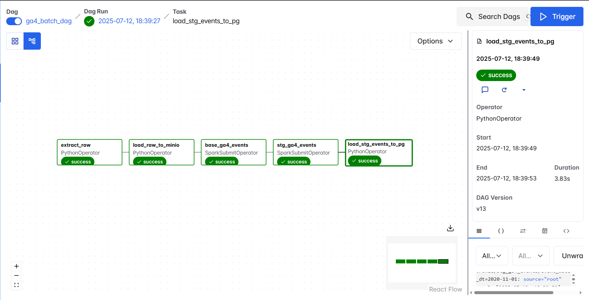
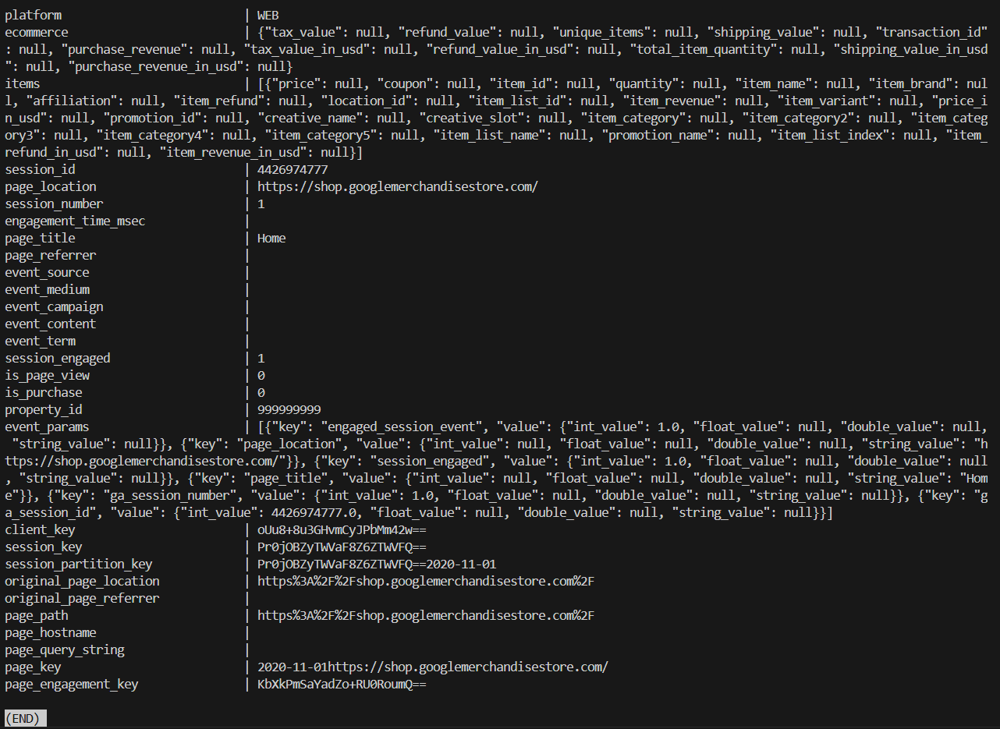

## Batch ETL Pipeline for Google Analytics 4 Data

### Overview
A fully containerised **batch ETL stack** that ingests big scale [Google Analytics 4](https://support.google.com/analytics) data, transforms it with Spark, orchestrates the workflow in Airflow, lands data facts/dimensions in Postgres for downstream ML/BI analysis.

---

### Tech Stack
| Layers | Stack | Highlights |
|-------|------|------------|
| Data Lake | MinIO (S3-compatible) | Fast & Cheap raw/staging Parquets |
| Transform | Apache Spark (PySpark) | Data modeling implemented in PySpark, Optimized for scale |
| Orchestrator | Apache Airflow | Idempotent Airflow-native DAGs |
| Serve | Postgres | Data Warehouse with event, session & user dimensions |
| Dev Ex | Docker Compose, Custom Images, Dev Container | Ready for production

---

### Architecture

```ascii
┌────────────┐   Extract  ┌───────────┐   Transform   ┌─────────┐  Load ┌──────────┐
  External DB ────────────► MinIO(S3) ────────────────►  Spark   ───────► Postgres │ 
└────────────┘  (bronze)  └───────────┘   (staging)   └─────────┘       └──────────┘
                                                                 
```

---

### Data Sources

Sample GA4 dataset extracted [BigQuery public datasets](https://cloud.google.com/bigquery/public-data) (92 days * 55,000 rows ~ 5M rows; pq table 68 columns)

---

### Data Models

| Tables            | Grain           | Purpose                                                       |
| ----------------- | --------------- | ------------------------------------------------------------- |
| base\_select      | raw events      | Clean field names; fields selected by design for downstream   |
| base\_ga4\_events | cleaned events  | Flatten & Normalize records, standardized, dedup fields       |
| stg\_ga4\_events  | keyed events    | Add surrogate key, sanitizes event parameters, preps for dims |

---

### Airflow DAG Screenshot



---

### Loaded Postgres Data Screenshot




### Usage

> Prereqs: Docker >= 24

```bash
# Clone this repo
git clone https://github.com/Creative-Ataraxia/GA4-Analytical-Pipeline.git

# Ran entire stack with docker compose
cd GA4-Analytical-Pipeline
docker compose up -d --build

# Copy your own GA4 export parquet into project-root/raw-data/
# Get the same exact dataset I used from here: https://cloud.google.com/bigquery/public-data

# After all docker container is healthy
# opens Airflow UI at http://localhost:8080, and manually trigger DAG called 'ga4_batch_dag' to execute the pipeline

# Verify row counts in Postgres
docker exec -it postgres psql -U postgres -d ga4_data -c "SELECT COUNT(*) FROM stg_ga4_events;"

```

### Experiement Locally

1) `cd GA4-Analytical-Pipeline` and `reopen in Dev Container` and you'll be in the same exact Airflow 3.0.2 + Python 3.10 + Spark 4.0.0 shell I developed this pipeline in.
2) Try submiting the spark jobs locally
`spark-submit --master local[4] /opt/spark-apps/staging/stg_ga4_events.py <YYYY-MM-DD> <days:int>`

### About
Happy to answer any question via issues; Connect with me on [Linkedin](https://www.linkedin.com/in/royma/);
My [Github Page](https://github.com/Creative-Ataraxia)

### License
This project is licensed under the MIT
[](LICENSE)